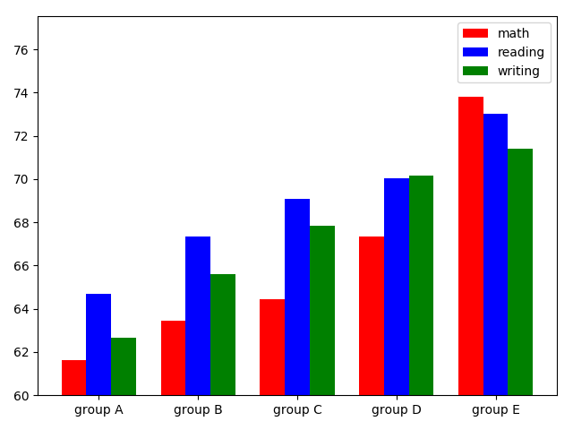

# Analyze_student_test_scores
<br/>

<h2>Scratter plot complaring student Math scores to Reading scores</h2> 


<br/>

<h2>Barchart complaring ethnic group scores</h2> 



<h3>Explaining the code</h3>
<p>First the data is converted to a Dataframe from a csv file.</p>

```
df = pd.read_csv("StudentsPerformance.csv")
```
<br/>
<p>Then I defined two functions. The first is for the scatter plot. The second is for the barchart.</p>

<h5>Scatter plot function</h5>

```
def scatter_plot_scores():
	# MATH SCORES TO READING SCORES

	math_scores = df['math score']
	reading_scores = df['reading score']

	plt.scatter(math_scores, reading_scores)
	plt.plot(range(105), 'r')
	plt.show()
```

</br>

<h5>Barchart function</h5>

```
def barchart_ethnicity_scores():
	# GROUPS TO SCORES

	n_groups = 5
	index = np.arange(n_groups)
	bar_width = 0.25
	fig, ax = plt.subplots()

	math = []
	reading = []
	writing = []

	groups = ['group A', 'group B', 'group C', 'group D', 'group E',]

	for group in groups:
		is_g = df['race/ethnicity'] == group
		group_df = df[is_g]
		group_math = group_df['math score'].mean()
		math.append(group_math)
		group_read = group_df['reading score'].mean()
		reading.append(group_read)
		group_write = group_df['writing score'].mean()
		writing.append(group_write)

	math_bar = plt.bar(index, math, bar_width, color='r', label='math')
	reading_bar = plt.bar(index + bar_width, reading, bar_width, color='b', label='reading')
	writing_bar = plt.bar(index + bar_width*2, writing, bar_width, color='g', label='writing')

	plt.xticks(index + bar_width, groups)
	plt.ylim(bottom=60)
	plt.legend()
	plt.tight_layout()

	plt.show()
```
